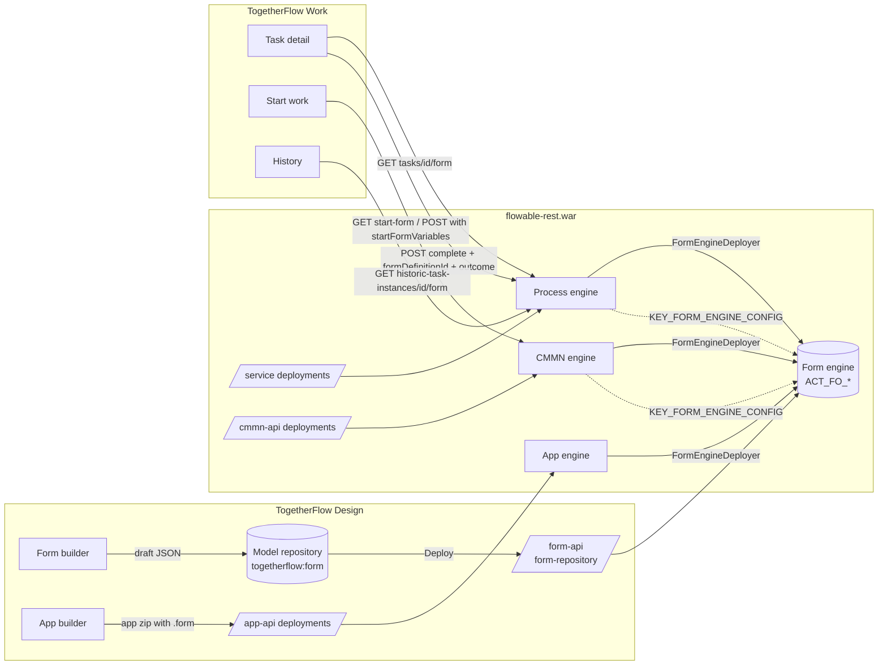

# TogetherFlow — Forms Requirements Document

Status: v1 — decision accepted, Option B ([ADR 0019](adr/0019-form-engine.md)), 2026-09-16
Owner: TBD
Companion to: [REQUIREMENTS.md](REQUIREMENTS.md) §7.1 (Forms), §7.4.6 (Form builder); [ADR 0007](adr/0007-flowable-native-form-renderer.md) (renderer), [ADR 0010](adr/0010-form-and-event-authoring.md) (authoring), [ADR 0012](adr/0012-conditional-field-visibility.md) (visibility).
Scope: forms that render, validate and are recorded **during real process and case execution** — the full feature, end to end, from the Design builder to the task in Work to the historic record in Control.

## Contents

- [1. Purpose](#1-purpose)
- [2. Where we are today — verified](#2-where-we-are-today--verified)
- [3. Goals](#3-goals)
- [4. Non-goals](#4-non-goals)
- [5. Options and recommendation](#5-options-and-recommendation)
- [6. Functional requirements](#6-functional-requirements)
- [7. Non-functional requirements](#7-non-functional-requirements)
- [8. Architecture and module layout](#8-architecture-and-module-layout)
- [9. Data model](#9-data-model)
- [10. REST API](#10-rest-api)
- [11. Delivery plan](#11-delivery-plan)
- [12. Acceptance — the Resignation golden path](#12-acceptance--the-resignation-golden-path)
- [13. Open questions](#13-open-questions)
- [14. Glossary](#14-glossary)

---

## 1. Purpose

A user task that declares a form must show that form. Today it does not: every task and every start form in TogetherFlow Work falls back to the raw variable grid with the message *"This task declares a form, but its definition could not be loaded."* The Resignation (Sales) example — fourteen forms, every human task bound to one — never shows a single field.

The cause is not the frontend. Work's renderer and Design's builder both exist and both speak Flowable's own form model. The cause is that **this distribution has no form engine.** Flowable removed the open-source form engine in 7.0 (this fork carries that removal as commit `270e5e77f8`, "Remove Form Engine", 2022-12-13), leaving only the API and model jars. Every engine-side hook, every REST endpoint and every frontend call is still in place and waiting for an implementation behind them.

This document specifies what "forms work, fully" means for this product, and how to get there. It is written so that the engine work, the frontend work and the acceptance test can each be picked up independently.

## 2. Where we are today — verified

Everything in this section was checked against the running code on 2026-09-16, not inferred from documentation. File references are to this repository.

### 2.1 The engine side

| Fact | Evidence |
|---|---|
| No form engine is initialised. | `GET /cmmn-api/cmmn-runtime/tasks/{id}/form` → `400 {"exception":"Form engine is not initialized"}`. The war contains `flowable-form-api` and `flowable-form-model` and nothing else form-related. |
| The full form API contract survives. | `modules/flowable-form-api`: `FormEngineConfigurationApi`, `FormRepositoryService`, `FormService`, `FormManagementService`, `FormFieldHandler`, `FormDefinition`, `FormDeployment`, `FormInstance`, `FormInfo`, `FormInstanceInfo`, plus the query interfaces. |
| The model is complete. | `modules/flowable-form-model`: `SimpleFormModel` (name, key, version, description, fields, outcomes, outcomeVariableName), `FormField` (id, name, type, value, required, readOnly, overrideId, placeholder, params, layout), `OptionFormField` (optionType, hasEmptyValue, options, optionsExpression), `ExpressionFormField` (expression), `FormContainer` (rows of fields), `FormOutcome` (id, name), `LayoutDefinition` (row). Nineteen field types in `FormFieldTypes`. |
| The process and CMMN engines already call into a form engine when one is registered. | `CommandContextUtil.getFormEngineConfiguration()` reads `EngineConfigurationConstants.KEY_FORM_ENGINE_CONFIG` ([CommandContextUtil.java:192](../../modules/flowable-engine/src/main/java/org/flowable/engine/impl/util/CommandContextUtil.java#L192)). 19 files in `flowable-engine` and 24 in `flowable-cmmn-engine` import `org.flowable.form.api`. |
| The public Java API is already form-aware. | `RuntimeService.startProcessInstanceWithForm`, `getStartFormModel`; `TaskService.completeTaskWithForm` (six overloads), `getTaskFormModel`; the CMMN equivalents `CmmnTaskService.completeTaskWithForm`, `CmmnRuntimeService.getStartFormModel`, and `CaseInstanceBuilder.startFormVariables(...).outcome(...).startWithForm()`. |
| Server-side validation is wired but empty. | `CompleteTaskWithFormCmd` calls `formService.validateFormFields(...)` when `isFormFieldValidationEnabled` ([CompleteTaskWithFormCmd.java:133](../../modules/flowable-engine/src/main/java/org/flowable/engine/impl/cmd/CompleteTaskWithFormCmd.java#L133)); the CMMN `CompleteTaskWithFormCmd` does the same; `ProcessEngineConfigurationImpl` and `CmmnEngineConfiguration` both carry `isFormFieldValidationEnabled`, and `validateFormFields` is an attribute on BPMN `UserTask`/`StartEvent` and CMMN `HumanTask`/`Stage` (`HasValidateFormFields`). In the removed 6.x engine, `validateFormFields` was **an empty method** — nothing was ever validated server-side. |
| Deployment of `.form` resources is not wired anywhere. | No `EngineDeployer` in `flowable-engine`, `flowable-cmmn-engine` or `flowable-app-engine` recognises a `.form` suffix. An app bundle containing `.form` files stores them as opaque app-deployment resources and ignores them. |
| The REST endpoints exist and fail. | `flowable-rest`: `/runtime/tasks/{taskId}/form`, `/repository/process-definitions/{id}/start-form`, `/repository/process-definitions/{id}/form-definitions`, `/history/historic-task-instances/{taskId}/form`. `flowable-cmmn-rest`: the four `cmmn-*` equivalents. `TaskActionRequest` already has `formDefinitionId` and `outcome`; `ProcessInstanceCreateRequest` and `CaseInstanceCreateRequest` already have `startFormVariables` and `outcome`. All of it returns the 400 above. |
| The removed engine is in git history, Apache 2.0. | `git ls-tree 270e5e77f8~1 modules/` lists `flowable-form-engine` (136 files), `flowable-form-engine-configurator` (17), `flowable-form-json-converter` (6), `flowable-form-rest` (43), `flowable-form-spring` (21), `flowable-form-spring-configurator` (11), plus `FormEngineAutoConfiguration`, `FlowableFormProperties`, `ConditionalOnFormEngine` in the Spring Boot autoconfigure module and a `flowable-spring-boot-sample-form`. Persistence was Liquibase (`ACT_FO_FORM_DEPLOYMENT`, `ACT_FO_FORM_RESOURCE`, `ACT_FO_FORM_DEFINITION`, `ACT_FO_FORM_INSTANCE`), dates were Joda-Time. |

### 2.2 The frontend side

| Fact | Evidence |
|---|---|
| Work has a Flowable-native renderer. | `togetherflow-common/src/forms/FormRenderer.tsx` (915 lines): real `<form>`, all nineteen field types, outcomes, model-level read-only as value, task-scoped `upload`, inline + summary errors, per-field blur validation, container/row layout. Constraints read from `params`: `description`/`hint`, `minLength`, `maxLength`, `min`/`minValue`, `max`/`maxValue`, `pattern`, `patternMessage`, `accept`, `maxFileSize` (`formModel.ts` `fieldConstraints`). |
| Conditional visibility is a TogetherFlow convention on `params`. | `params.tfVisibleWhen` — equals / notEquals / isSet / isEmpty — presentation only, never security ([ADR 0012](adr/0012-conditional-field-visibility.md), `visibility.ts`). |
| Work fetches the form from the engine and falls back. | `TaskApi.getForm` → `GET /runtime/tasks/{id}/form`, returns `null` on any failure ([resources.ts:92-102](../../modules/togetherflow-common/src/main/frontend/src/api/resources.ts#L92-L102)); `TaskDetail` then shows the variable grid. `StartWork` does the same for process and case start forms. |
| Work completes with variables only. | `TaskApi.complete(taskId, variables)` — no `formDefinitionId`, no `outcome`. Nothing ever calls `completeTaskWithForm`. |
| Design has a full builder. | `togetherflow-design/src/features/forms/FormBuilder.tsx` + `FieldProperties.tsx`: all nineteen types, `pattern`/`minLength`/`maxLength`, `tfVisibleWhen`, outcomes; drafts saved to the model repository under category `togetherflow:form`. |
| Design cannot deploy a form. | Per ADR 0010 the builder "ships no Deploy button; it states the constraint on screen". Forms are bundled by the app builder into the app zip — which, per §2.1, the engine then ignores. |
| Control has no form surface. | Nothing lists form definitions, deployments or instances. |
| The Resignation example is fully form-bound and never renders one. | `examples/resignation-sales/forms/*.form` (14 files); `flowable:formKey` on the case plan model, every `humanTask` and every `userTask`. `deploy.sh` posts processes, the case and the app — never the forms. |

### 2.3 What this means

The shortest honest summary: **authoring works, rendering works, nothing in between exists.** A form drawn in Design cannot reach a running task by any path, and a task that names a form has no service to ask. The gap is one component — a form engine — plus the wiring that lets the other engines find it, deploy into it, and record what came back from it.

## 3. Goals

- **G1 — Forms render in execution.** A task, a process start and a case start that declare a `formKey` show that form in Work, pre-filled from the instance's variables, with outcomes as buttons.
- **G2 — Submissions are validated by the server.** Required, type, range, length, pattern and option membership are enforced in the engine, not only in the browser. A form completed over raw REST is held to the same rules as one completed in Work.
- **G3 — Submissions are recorded.** Every submission is a form instance: who, when, which outcome, which values, against which task/process/case — queryable, visible in history, deletable with the instance, exportable with the user's data.
- **G4 — One model, one path.** The JSON Design writes is the JSON the engine deploys is the JSON Work renders. No translation layer, no second schema.
- **G5 — Deployable like everything else.** A form deploys standalone, inside a process/case deployment, or inside an app — versioned per key per tenant, with the same parent-deployment resolution the other engines use.
- **G6 — Same conventions as the other engines.** Configurator, command/session pattern, MyBatis mappings, hand-written DDL per dialect, `FlowableVersions` upgrade steps, REST module, Spring Boot starter — a sixth engine that looks like the other five ([CLAUDE.md](../../CLAUDE.md)).
- **G7 — The Resignation example proves it.** All fourteen forms render and submit through the fifteen-step walkthrough with no variable grid in sight (§12).

## 4. Non-goals

- **Legacy BPMN "form properties"** (`<flowable:formProperty>`, `GET/POST /form/form-data`). This is the pre-6.0 mechanism and stays as it is; nothing here extends it.
- **A new form schema.** Flowable's `SimpleFormModel` is the schema. Camunda's form-js schema is not adopted (already decided in ADR 0007).
- **Rich text / HTML authoring inside fields, PDF rendering of submitted forms, e-signature.** Recorded as later candidates in §13; out of this scope.
- **Server-side rendering.** Forms are rendered by the SPA. The engine serves the model and the values; it does not produce HTML.
- **Partial-save / draft form instances** while a task is open. Considered in §13; not in v1.
- **Replacing the variable grid.** It stays as the fallback for tasks with no `formKey`, and as the "raw" view for operators.

## 5. Options and recommendation

### Option A — Client-side lookup of the Design draft

Work, when the engine returns "Form engine is not initialized", looks up the draft with `key = formKey` in `/repository/models` (category `togetherflow:form`) and renders that. Submission stays a plain `complete` with variables.

*For:* a few days' work, all in the frontend; the Resignation demo works immediately.
*Against:* renders a **draft**, not a deployed, versioned artefact — a modeller editing a form changes what a live task shows; **no server-side validation** (G2 fails); **no form instance record** (G3 fails); expression fields and `optionsExpression` cannot be evaluated (no expression context in the browser); `people`/`functional-group` values are unchecked strings; anyone able to complete a task over REST bypasses every rule. It is a preview, not a feature.

### Option B — A form engine

Reinstate a form engine implementing `flowable-form-api`, registered on the process, CMMN and app engines through a configurator, with deployment, versioning, validation, form instances, REST and a Spring Boot starter.

*For:* the only option that meets G1–G7; every hook it needs is already present; the removed 6.x engine (Apache 2.0, in git history) is a working starting point for perhaps 70% of it.
*Against:* real backend scope — a new persistence area (four tables, six dialects, upgrade scripts), a REST module, a starter, and CI on every database.

### Option C — Flowable Enterprise's form engine

Not open source. Ruled out on licence and on the product's independence from the vendor (REQUIREMENTS.md §1).

### Recommendation

**Option B**, built by porting the 6.x engine from commit `270e5e77f8~1` to the 8.x conventions and then closing the gaps that engine never filled (validation, deployer wiring on all three engines, hand-written DDL, `java.time`). Details in §8 and §11.

**Option A is not recommended as a bridge.** Its whole implementation (a formKey → draft lookup) would be removed the day Option B lands, and while it existed it would teach users that forms "work" when submissions are unvalidated and unrecorded. If a demo is needed before Phase 2 lands, use Design's built-in preview.

Recorded as [ADR 0019](adr/0019-form-engine.md).

## 6. Functional requirements

Requirements are numbered `FR-<area>.<n>`. **MUST** is v1 scope; **SHOULD** is v1 unless cut for time; **MAY** is a later candidate.

### 6.1 Form model

- **FR-M.1** The engine MUST accept, store and serve exactly `SimpleFormModel` as defined in `flowable-form-model`, serialised as JSON. No field of the model is dropped or renamed on the round trip; unknown top-level properties and unknown `params` keys MUST be preserved byte-for-byte (Design's `tfVisibleWhen` and any future convention depend on this).
- **FR-M.2** All nineteen `FormFieldTypes` MUST be supported end to end: `text`, `multi-line-text`, `integer`, `decimal`, `amount`, `date`, `boolean`, `radio-buttons`, `dropdown`, `upload`, `expression`, `people`, `functional-group`, `container`, `hyperlink`, `spacer`, `horizontal-line`, `headline`, `headline-with-line`.
- **FR-M.3** The following `params` MUST be honoured by server-side validation (FR-S.3) and remain honoured by the renderer: `minLength`, `maxLength`, `min`/`minValue`, `max`/`maxValue`, `pattern` (Java regex, whole-value match), `patternMessage`, `minDate`, `maxDate` (ISO dates, new), `accept` and `maxFileSize` (upload; enforced by the attachment endpoint, FR-S.6).
- **FR-M.4** `outcomes` MUST be supported: a form with outcomes is completed with exactly one outcome id; the chosen outcome is written to `outcomeVariableName` if set, otherwise to `form_<formKey>_outcome` (the 6.x convention, kept for compatibility with models in the wild).
- **FR-M.5** `readOnly` fields MUST be served with their current value and MUST be ignored on submission (a client cannot change a read-only field by posting it).
- **FR-M.6** `expression` fields MUST be evaluated by the engine at fetch time against the instance's variables and served as values; they MUST be rejected if present in a submission.
- **FR-M.7** `optionsExpression` on `dropdown`/`radio-buttons` MUST be evaluated at fetch time; the result MUST be a JSON array of `{id, name}` or a `List<Option>`; option membership is validated on submission against the evaluated set (FR-S.3).
- **FR-M.8** `people` and `functional-group` values MUST be IDM user ids / group ids. On submission the engine MUST verify the id exists (through `IdmIdentityService` when an IDM engine is present; otherwise accept).
- **FR-M.9** `container` MUST nest fields in rows; validation and submission MUST treat nested fields exactly as top-level fields (flatten), as the renderer already does.
- **FR-M.10** `date` values MUST be exchanged as ISO `yyyy-MM-dd` strings and stored as `java.time.LocalDate` variables. Joda-Time is not used anywhere in the port.
- **FR-M.11** `amount` and `decimal` MUST be stored as `java.math.BigDecimal` (never `double`); `integer` as `Long`; `boolean` as `Boolean`.
- **FR-M.12** `overrideId = true` MUST cause the field id to be used verbatim as the variable name; otherwise the variable name is the field id as well (the engine's existing behaviour; stated so nobody "fixes" it).
- **FR-M.13** The model MAY carry per-locale labels in `params.i18n` in a later version; v1 serves labels as authored.

### 6.2 Authoring (TogetherFlow Design)

- **FR-A.1** The builder MUST expose every constraint in FR-M.3 in the field properties panel, with the same key names, so a form built in Design validates identically in the browser and on the server.
- **FR-A.2** The builder MUST author `outcomes` and `outcomeVariableName`.
- **FR-A.3** The builder MUST author `optionsExpression` and `expression` (as expression text, with a clear "evaluated by the engine at runtime" note), `people`, `functional-group`, `upload` with `accept`/`maxFileSize`.
- **FR-A.4** The builder's preview MUST use `FormRenderer` from `togetherflow-common` unchanged, with sample values, so what is previewed is what Work will show.
- **FR-A.5** The builder MUST gain a **Deploy** button, deploying the draft as a standalone form deployment (`POST /form-api/form-repository/deployments`), and MUST report the resulting definition id and version. The "cannot deploy" notice from ADR 0010 is removed.
- **FR-A.6** A form referenced by a process, case or app model MUST be resolvable at deploy time: when deploying a process/case draft, Design SHOULD offer to include the forms its `formKey`s reference in the same deployment (as `.form` resources), so parent-deployment resolution (FR-D.5) works without a separate step.
- **FR-A.7** The app builder MUST keep bundling `.form` files; with FR-D.4 they become real deployments.
- **FR-A.8** Key uniqueness: the builder MUST warn when a draft's key collides with a deployed form definition of a different draft, and MUST show the deployed version history for the key (the engine's `form-definitions?key=`).
- **FR-A.9** Design SHOULD validate a form draft against the same rules the engine will apply on deployment (FR-D.3) before allowing Deploy.

### 6.3 Deployment and versioning (engine)

- **FR-D.1** `FormRepositoryService.createDeployment()` MUST accept `.form` resources (suffix `.form`, JSON body), by name, by bytes, by input stream and by classpath resource, and MUST support `name`, `category`, `tenantId`, `parentDeploymentId`.
- **FR-D.2** Each deployed resource MUST produce a `FormDefinition` with `key` and `name` from the JSON, `version` = previous highest version for (key, tenant) + 1, `deploymentId`, `parentDeploymentId`, `resourceName`, `description`, `category`.
- **FR-D.3** A resource that is not valid JSON, has no `key`, has a duplicate field id, an unknown `type`, an `outcome` without an id, or a `container` nested in a `container` MUST fail the whole deployment with a message naming the resource and the problem.
- **FR-D.4** A `FormEngineConfigurator` MUST register an `EngineDeployer` on the **process**, **CMMN** and **app** engines so that `.form` resources inside a BPMN, CMMN or app deployment are deployed to the form engine with `parentDeploymentId` = the parent deployment's id. Un-deploying the parent MUST un-deploy them (cascade honours the parent's cascade flag).
- **FR-D.5** Resolution of a `formKey` at runtime MUST follow the same order the other engines use: (1) a definition with that key whose `parentDeploymentId` equals the process/case definition's deployment id — "same deployment" semantics; (2) otherwise the latest version for (key, tenant); (3) if `fallbackToDefaultTenant` is set on the engine or on the element, the latest version in the default tenant. This is what `FormService.getFormModelWithVariablesByKeyAndParentDeploymentId` already promises.
- **FR-D.6** A deployment cache MUST hold parsed `FormInfo`s keyed by definition id, with the standard size-limited LRU used by the other engines, and MUST be invalidated on undeploy and on `changeDeploymentParentDeploymentId`.
- **FR-D.7** `setDeploymentTenantId`, `setDeploymentCategory`, `setFormDefinitionCategory`, `changeDeploymentParentDeploymentId` MUST be implemented (all are on the API).
- **FR-D.8** `FormManagementService` MUST expose table counts and metadata for `ACT_FO_*` so Control's *System* view can show them like the other engines'.
- **FR-D.9** Change-tenant-id support (`FormChangeTenantIdEntityTypes`) MUST be implemented so `flowable.common.engine.api.tenant.ChangeTenantIdBuilder` covers form deployments, definitions and instances.

### 6.4 Runtime binding

- **FR-R.1** BPMN: `flowable:formKey` on a `startEvent` and on a `userTask` MUST resolve per FR-D.5. `flowable:formFieldValidation` on the element (`HasValidateFormFields`) and `isFormFieldValidationEnabled` on the configuration MUST gate FR-S.3 exactly as `CompleteTaskWithFormCmd` already implements — in both the process and the CMMN engine.
- **FR-R.2** CMMN: `flowable:formKey` on the `casePlanModel` (start form) and on `humanTask` MUST resolve the same way.
- **FR-R.3** `GET …/tasks/{id}/form` MUST return the form model **with values**: each field's `value` filled from the task's variables (task-local first, then scope), `expression` fields evaluated, `optionsExpression` evaluated, `readOnly` respected. Date/amount/decimal values are serialised per FR-M.10/11.
- **FR-R.4** `GET …/start-form` MUST return the form model with `expression`/`optionsExpression` evaluated against an empty variable context; a failure to evaluate MUST degrade that field to an empty value with a warning in the log, not fail the whole request.
- **FR-R.5** Historic: `GET …/historic-task-instances/{id}/form` MUST return the **form instance** model — the submitted values, `submittedBy`, `submittedDate`, `selectedOutcome` — if a form instance exists for the task, else 404.
- **FR-R.6** A task with **no** `formKey` MUST keep today's behaviour (Work shows the variable grid; the endpoint 400s with "task has no form"). The fallback is a feature, not a symptom.
- **FR-R.7** Multi-instance user tasks: each instance resolves and records its own form instance (`taskId` is unique per instance).
- **FR-R.8** `TaskService.saveTask` with a form (partial save) MAY be supported later; v1 does not create form instances on save.

### 6.5 Submission and validation

- **FR-S.1** Completing a task with a form MUST be one operation: `completeTaskWithForm(taskId, formDefinitionId, outcome, variables)` → validate (FR-S.3) → convert to typed variables (FR-S.4) → write the outcome variable (FR-M.4) → persist the form instance (FR-S.5) → complete the task. Failure at any step rolls the whole command back (it is one `Command` in one transaction, per the command/session pattern).
- **FR-S.2** Starting a process/case with a form MUST likewise be one operation (`RuntimeService.startProcessInstanceWithForm`; `CaseInstanceBuilder…startWithForm()`): the form instance is recorded against the new instance id with no task id.
- **FR-S.3 Server-side validation** (this is new work; the 6.x method was empty). The engine MUST reject a submission, with a `FlowableFormValidationException` listing **every** failing field, when:
  - a `required` field is missing or empty (for `boolean`, missing counts as empty only if `required`);
  - a value cannot be converted to the field's type (FR-M.10/11);
  - `integer`/`decimal`/`amount` is outside `min`..`max`;
  - `text`/`multi-line-text` length is outside `minLength`..`maxLength` or does not match `pattern`;
  - `date` is outside `minDate`..`maxDate`;
  - `dropdown`/`radio-buttons` value is not among the (static or evaluated) options, unless `hasEmptyValue` and the value is empty;
  - `people`/`functional-group` id does not exist (FR-M.8);
  - an `outcome` was posted that is not one of the model's outcomes, or the model has outcomes and none was posted;
  - a `readOnly`, `expression` or presentational field is present in the submission (ignored, not rejected — logged at debug).
  - Hidden-by-`tfVisibleWhen` fields are **not** exempt (visibility is presentation only, ADR 0012); a model whose required field can be hidden is a modelling error Design SHOULD flag (FR-A.9).
- **FR-S.4** `getVariablesFromFormSubmission` MUST return typed variables per FR-M.10/11/12, MUST drop presentational, `expression` and `readOnly` fields, and MUST include the outcome variable.
- **FR-S.5** Every successful submission MUST persist a `FormInstance` (`ACT_FO_FORM_INSTANCE`) with the form definition id, task id, process instance/definition ids **or** scope id/type/definition id (CMMN), `submittedBy` (authenticated user id), `submittedDate`, `tenantId`, and the submitted values as a JSON byte array in the shared byte-array table (`FORM_VALUES_ID_`).
- **FR-S.6** `upload` fields: the value MUST be an attachment id already created through the task attachment endpoint (or the attachment gateway when configured); the engine's `FormFieldHandler.handleFormFieldsOnSubmit` MUST verify the attachment belongs to the task (the current `AttachmentController.upload` gap noted in STATUS.md is closed by this check, not left to the client). `accept`/`maxFileSize` are enforced where the bytes arrive.
- **FR-S.7** Validation errors MUST be returned over REST as `400` with a body Work can map to fields: `{ "message": "Form validation failed", "exception": "...", "fields": [ { "id": "...", "code": "required|type|min|max|minLength|maxLength|pattern|minDate|maxDate|option|identity|outcome", "message": "..." } ] }`. `code` is stable and localisable by the client; `message` is a developer-facing default.
- **FR-S.8** A submission MUST be rejected if the `formDefinitionId` posted does not resolve to the same key the task's `formKey` resolves to (a client cannot substitute a different form for a task).

### 6.6 History, audit and data lifecycle

- **FR-H.1** Form instances MUST be queryable by id, form definition id/key, task id, process instance id, scope id/type, submitted-by, submitted-date range, tenant, with paging and sorting (`FormInstanceQuery`), through Java and REST.
- **FR-H.2** Deleting a process instance or case instance (runtime or historic) MUST delete its form instances; deleting a form definition/deployment with `cascade` MUST delete its instances; `deleteFormInstancesByProcessDefinition` / `ByScopeDefinition` MUST be honoured by the engines' definition-delete cascades.
- **FR-H.3** Work's **My history** and the historic task detail MUST show the submitted form read-only (values, outcome, who, when) — using `FormRenderer` in its model-read-only mode, not a second component.
- **FR-H.4** Control's process/case instance detail MUST list the form instances for the instance and open each read-only; Control's task view MUST link to the task's form instance.
- **FR-H.5** The user-data export (`userDataExport` in `togetherflow-common`) MUST include the form instances the user submitted and MAY include those in which a `people` field names the user.
- **FR-H.6** History level: form instances are written regardless of `historyLevel` (they are runtime records that happen to persist), matching 6.x semantics; documented in OPERATIONS.md.

### 6.7 TogetherFlow Work

- **FR-W.1** Task detail MUST render the form from `GET …/tasks/{id}/form`, gated exactly as today (disabled until claimed), and MUST complete through `completeTaskWithForm` semantics: `POST …/tasks/{id}` with `action: "complete"`, `formDefinitionId`, `outcome`, `variables` — the request shape `TaskActionRequest` already has.
- **FR-W.1a** Every scope-bound call — completion with or without a form, the live form (`…/tasks/{id}/form`) and the historic form — MUST go to the engine that owns the task: `/cmmn-api/cmmn-runtime` and `/cmmn-api/cmmn-history` when the task's `scopeType` is `cmmn`, the process API otherwise. The process engine refuses to complete a case task ("should be completed via the cmmn engine API"), and only the case engine resolves a task form against the case deployment it belongs to. Claim, unclaim, delegate, comments, attachments and variables stay on the shared task service through the process API. (`TaskApi` takes both clients; the task itself is passed as the scope.)
- **FR-W.2** Outcomes MUST render as the task's action buttons (replacing the single **Complete** when the model has outcomes); the primary is the first outcome.
- **FR-W.3** Start work MUST render process and case start forms and start through `startFormVariables` + `outcome` on the existing create requests. Uploads on a start form stay unsupported and say so (no task to attach to yet) — unchanged.
- **FR-W.4** Server validation errors (FR-S.7) MUST be mapped onto fields inline and into the focus-taking summary; a `code` with no client translation falls back to the server message.
- **FR-W.5** `people` and `functional-group` fields MUST use a picker backed by `/idm-api/users` and `/idm-api/groups` (typeahead, id + display name), storing the id; read-only views resolve id → name.
- **FR-W.6** `expression` fields render as values; `hyperlink` renders as a link; presentational types render as today.
- **FR-W.7** The variable grid MUST remain available behind a secondary "Variables" tab on a task that has a form (operators need it), and MUST remain the primary view for tasks without one.
- **FR-W.8** Historic task detail MUST show the form instance read-only (FR-H.3).
- **FR-W.9** The existing fallback message ("its definition could not be loaded") MUST be reserved for genuine failures (network, 5xx, deleted definition) and MUST name the `formKey` and the HTTP status, so a misconfiguration is diagnosable from the screen.

### 6.8 TogetherFlow Control

- **FR-C.1** A **Forms** section MUST list form deployments and form definitions (key, name, version, tenant, deployment, parent deployment) with the same list/detail/filters as process definitions, and MUST show the definition JSON and a rendered preview.
- **FR-C.2** Deleting a form deployment (with/without cascade) MUST be available with the same confirmation pattern as other deployments.
- **FR-C.3** Form instances MUST be listed per process/case instance (FR-H.4) and globally with the FR-H.1 filters.
- **FR-C.4** The *System* view MUST include the `ACT_FO_*` tables and the form engine's version/properties.

### 6.9 Multi-tenancy

- **FR-T.1** Every form deployment, definition and instance carries `tenantId`; all queries filter by the request's tenant context (REQUIREMENTS.md §8, ADR 0004).
- **FR-T.2** `fallbackToDefaultTenant` MUST be honoured per FR-D.5.
- **FR-T.3** Changing a deployment's tenant MUST move its definitions and instances (FR-D.9).

### 6.10 Security

- **FR-X.1** Form definitions and instances are reachable only through authenticated REST with the `access-rest-api` privilege, like every other engine resource.
- **FR-X.2** A form instance is readable only by a caller who may read the task/instance it belongs to (the same `authorization` checks the task and instance resources apply).
- **FR-X.3** Expressions are evaluated **only** from deployed definitions. No expression text is ever accepted from a submission or from a query parameter.
- **FR-X.4** Upload handling per FR-S.6; attachment ids from other tasks are rejected.
- **FR-X.5** `people`/`functional-group` pickers only return users/groups the caller may see under IDM's rules; the engine re-checks existence, not visibility.

### 6.11 Compatibility and migration

- **FR-P.1** Existing `togetherflow:form` drafts deploy unchanged (they are already `SimpleFormModel` JSON).
- **FR-P.2** Existing processes and cases with `formKey`s start working without redeployment once a form with that key is deployed (resolution is by key at runtime).
- **FR-P.3** No change to any existing table. Four new `ACT_FO_*` tables (§9). A new `FlowableVersions` entry, and `upgrade` scripts for every dialect creating them, so an existing database upgrades in place. `SqlUpgradeValidationTest` covers the new version.
- **FR-P.4** The Resignation example's `deploy.sh` MUST post the fourteen forms (standalone deployment, one call with fourteen resources) *before* the case and processes, and the case/process deployment SHOULD instead include them as resources so FR-D.5 (1) applies. The README and USER_MANUAL are updated.
- **FR-P.5** Engine property `flowable.form.enabled` (default `true` when the starter is present) MUST allow switching the engine off, in which case behaviour is exactly today's.

## 7. Non-functional requirements

| Area | Requirement |
|---|---|
| **Performance** | Fetching a task form (definition cached) completes in < 100 ms server-side excluding variable fetch on H2/Postgres with 10k definitions; the deployment cache is warm after first access. A submission adds at most two inserts (form instance, byte array) to task completion. |
| **Database** | Hand-written DDL for every dialect the other engines ship (h2, hsql, mysql — also used by mariadb —, postgres, mssql, db2, oracle) under `org/flowable/form/db/{create,drop,upgrade}`, aggregated into `distro/sql/`. Indexes on `ACT_FO_FORM_DEFINITION(KEY_, TENANT_ID_, VERSION_)`, `ACT_FO_FORM_INSTANCE(TASK_ID_)`, `(PROC_INST_ID_)`, `(SCOPE_ID_, SCOPE_TYPE_)`. CI runs the engine's tests on every DB profile in `.github/workflows/`. |
| **Observability** | Deployment, undeployment and validation failures logged at INFO/WARN with definition key and version; `FormManagementService` metrics available to Control. Engine dispatches `FlowableEngineEventType` entity events for form instance create/delete, so listeners and the event registry can react. |
| **i18n** | All Work/Design/Control strings through `togetherflow-common` i18n (ADR 0013); validation `code`s have client translations. |
| **Accessibility** | The renderer's existing rules (§14 of REQUIREMENTS.md) apply to the new pickers and outcome buttons; the error summary takes focus; outcome buttons are real buttons in a `<form>`. |
| **Theming** | Light and dark, as every other screen. |
| **Testing** | Engine: unit tests per command on H2 (`FlowableFormExtension` restored), deployment/resolution/validation matrices, cascade-delete tests with process and CMMN engines through the configurator. REST: resource tests in `flowable-form-rest` and for the activated endpoints in `flowable-rest`/`flowable-cmmn-rest`, plus OpenAPI spec regeneration under `docs/public-api`. Frontend: component tests for pickers, outcome buttons, error mapping; contract assertions against the regenerated spec (ADR 0005). E2E: §12. |
| **Checkstyle** | No star imports; Jackson only in `*Jackson2*` classes or via `FlowableJsonNode` — the JSON converter is written against the `flowable-engine-common` JSON abstraction, not against `com.fasterxml` directly (import-control.xml). |
| **Documentation** | OPERATIONS.md gains a *Forms* section (enabling, properties, tables, failure modes); STATUS.md records what is verified; ADR 0019 records the decision; the public OpenAPI gains `form-api`. |

## 8. Architecture and module layout

### 8.1 Modules

Mirrors the DMN family, which is the closest existing shape (`flowable-dmn-engine`, `-engine-configurator`, `-spring`, `-spring-configurator`, `-rest`, two Spring Boot starters).

| Module | Contents | Origin |
|---|---|---|
| `modules/flowable-form-api` | unchanged | exists |
| `modules/flowable-form-model` | unchanged; add `minDate`/`maxDate` param constants and a `FormValidationError` value type | exists |
| `modules/flowable-form-json-converter` | `FormJsonConverter`: `SimpleFormModel` ⇄ JSON, preserving unknown properties, written on `FlowableJsonNode` | restore + port |
| `modules/flowable-form-engine` | `FormEngineConfiguration extends AbstractEngineConfiguration`; `FormEngine`, `FormEngines`; `FormRepositoryServiceImpl`, `FormServiceImpl`, `FormManagementServiceImpl`; entities + entity managers + data managers; MyBatis mappings; deployer, parser, cache; **new** `FormFieldValidator`; DDL | restore + port + new |
| `modules/flowable-form-engine-configurator` | `FormEngineConfigurator`: shares datasource, command executor, session factories, transaction context (per CLAUDE.md); registers `KEY_FORM_ENGINE_CONFIG`; registers a `FormEngineDeployer` (`EngineDeployer`) on the process, CMMN **and app** engines | restore + extend (app engine) |
| `modules/flowable-form-spring`, `-spring-configurator` | Spring-managed engine and configurator | restore |
| `modules/flowable-form-rest` | `/form-api` resources (§10) | restore + port |
| `flowable-spring-boot-autoconfigure` | `FormEngineAutoConfiguration`, `FormEngineServicesAutoConfiguration`, `FormEngineRestConfiguration`, `FlowableFormProperties`, `ConditionalOnFormEngine` | restore |
| `flowable-spring-boot-starter-form`, `-form-rest` | starters, shaped like the DMN pair; the umbrella `flowable-spring-boot-starter` and `-starter-rest` depend on them | new — 6.x had no dedicated form starter; the engine rode in on the umbrella starters via autoconfigure |
| `modules/flowable-app-rest` | depends on `flowable-spring-boot-starter-form-rest`; mounts `/form-api`; `flowable-default.properties` gains `flowable.form.*` | change |
| `togetherflow-common` (frontend) | `FormApi` client for `/form-api`; `TaskApi.completeWithForm`; `ProcessApi`/`CaseApi` start-with-form; `IdentityPicker`; validation-error mapping; types + contract assertions | change |
| `togetherflow-work`, `-design`, `-control` | §6.7, §6.2, §6.8 | change |

The reactor placement follows the others: the engine and configurator in the root `<modules>`; spring, REST and starters under the `distro` profile (CLAUDE.md, *Module reactor caveat*).

### 8.2 How the pieces connect

The runtime sequence for one task:

1. Work: `GET /runtime/tasks/{id}/form` → process engine → `FormService.getFormModelWithVariablesByKeyAndParentDeploymentId(formKey, deploymentId, taskId, variables)` → resolve per FR-D.5 → fill values, evaluate expressions → JSON.
2. User fills the form, presses an outcome.
3. Work: `POST /runtime/tasks/{id}` `{action: complete, formDefinitionId, outcome, variables}` → `CompleteTaskWithFormCmd` → `validateFormFields` (FR-S.3) → `getVariablesFromFormSubmission` (FR-S.4) → `createFormInstance` (FR-S.5) → `FormFieldHandler.handleFormFieldsOnSubmit` (FR-S.6) → task completes → agenda continues.
4. Later: `GET /history/historic-task-instances/{id}/form` → form instance model with the recorded values.

Everything on the engine side of that sequence except the form engine itself already exists.

### 8.3 Porting notes (from `270e5e77f8~1`)

Things the 6.x code does that the 8.x codebase no longer accepts, found by inspecting the removed tree — each is a known task, not a surprise:

- **Liquibase → hand-written SQL.** The 6.x engine created its schema with `flowable-form-db-changelog.xml`. This repo's convention is `create/drop/upgrade` SQL per dialect plus a `FlowableVersions` entry. Write the DDL once from the changelog's column list (§9).
- **Joda-Time → `java.time`.** `GetFormModelWithVariablesCmd` and `GetVariablesFromFormSubmissionCmd` used `org.joda.time.LocalDate` and a `yyyy-M-d` formatter. Replace with `LocalDate` and ISO `yyyy-MM-dd`.
- **Jackson → `FlowableJsonNode`.** The converter used `com.fasterxml.jackson.databind` directly. Checkstyle's import-control forbids that outside `*Jackson2*` classes; write the converter on the engine-common abstraction (there are `jackson2` and `jackson3` implementations).
- **`AbstractEngineConfiguration` API drift.** Session factories, `ServiceConfiguration` split, `EngineConfigurationConstants`, `CommandContextUtil` shapes have moved since 6.8; the CMMN/DMN configurators are the reference for the current shape.
- **Empty validation.** `FormServiceImpl.validateFormFields` was a no-op. FR-S.3 is new code.
- **App engine deployer.** The 6.x configurator registered the deployer on the process and CMMN engines; the app engine ignored `.form`. FR-D.4 adds it.
- **Tests.** `FlowableFormExtension` / `FormTestHelper` port straightforwardly; the JUnit 4 `FlowableFormRule` can be dropped.

## 9. Data model

Four tables, mirroring the 6.x schema (column list taken from the removed changelog; the scope columns were already there via its later changesets). Created by hand-written SQL per dialect; `form.schema.version` in `ACT_GE_PROPERTY`.

| Table | Columns |
|---|---|
| `ACT_FO_FORM_DEPLOYMENT` | `ID_` PK, `NAME_`, `CATEGORY_`, `DEPLOY_TIME_`, `TENANT_ID_`, `PARENT_DEPLOYMENT_ID_` |
| `ACT_FO_FORM_RESOURCE` | `ID_` PK, `NAME_`, `DEPLOYMENT_ID_` FK, `RESOURCE_BYTES_` (blob) |
| `ACT_FO_FORM_DEFINITION` | `ID_` PK, `NAME_`, `VERSION_`, `KEY_`, `CATEGORY_`, `DEPLOYMENT_ID_` FK, `PARENT_DEPLOYMENT_ID_`, `TENANT_ID_`, `RESOURCE_NAME_`, `DESCRIPTION_` |
| `ACT_FO_FORM_INSTANCE` | `ID_` PK, `FORM_DEFINITION_ID_` FK, `TASK_ID_`, `PROC_INST_ID_`, `PROC_DEF_ID_`, `SCOPE_ID_`, `SCOPE_TYPE_`, `SCOPE_DEFINITION_ID_`, `SUBMITTED_DATE_`, `SUBMITTED_BY_`, `FORM_VALUES_ID_` (→ a row in `ACT_FO_FORM_RESOURCE` holding the values JSON; the chosen outcome is recorded inside that JSON as `flowable_form_outcome`), `TENANT_ID_` |

Plus `ACT_FO_*` rows in the property table for the schema version, following `FlowableVersions`. Entities extend `AbstractEntity` (revision column) where the other engines' equivalents do.

## 10. REST API

### 10.1 Activated (already in `flowable-rest` / `flowable-cmmn-rest`)

| Endpoint | Behaviour with the engine |
|---|---|
| `GET /service/runtime/tasks/{id}/form` · `GET /cmmn-api/cmmn-runtime/tasks/{id}/form` | Form model with values (FR-R.3) |
| `GET /service/repository/process-definitions/{id}/start-form` · `GET /cmmn-api/cmmn-repository/case-definitions/{id}/start-form` | Start form model (FR-R.4) |
| `GET …/process-definitions/{id}/form-definitions` · `…/case-definitions/{id}/form-definitions` | Form definitions resolvable from the definition's deployment |
| `GET /service/history/historic-task-instances/{id}/form` · CMMN equivalent | Form instance model (FR-R.5) |
| `POST /service/runtime/tasks/{id}` · `POST /cmmn-api/cmmn-runtime/tasks/{id}` `{action: "complete", formDefinitionId, outcome, variables}` | `completeTaskWithForm` (FR-S.1); `400` per FR-S.7. A case task MUST be completed through the CMMN one — the process engine refuses it (FR-W.1a) |
| `POST /service/runtime/process-instances` `{…, startFormVariables, outcome}` · `POST /cmmn-api/cmmn-runtime/case-instances` | start with form (FR-S.2) |

### 10.2 New — `/form-api` (`flowable-form-rest`, restored)

| Resource | Endpoints |
|---|---|
| Deployments | `GET/POST /form-repository/deployments`, `GET/DELETE /form-repository/deployments/{id}`, `GET …/{id}/resourcedata/{resourceId}` |
| Definitions | `GET /form-repository/form-definitions` (filters: key, keyLike, name, nameLike, version, latest, deploymentId, parentDeploymentId, tenantId, category), `GET /form-repository/form-definitions/{id}`, `GET …/{id}/model` (the JSON), `GET …/{id}/resourcedata`, `PUT …/{id}` (category) |
| Models with variables | `POST /form/model` `{formDefinitionId | formDefinitionKey, parentDeploymentId?, taskId?, processInstanceId?, scopeId?, variables}` → model with values (used by Design preview against live data, and by Control) |
| Instances | `GET /form/form-instances` (FR-H.1 filters), `POST /form/form-instances` (create — for integrations that record a form outside a task), `GET /form/form-instances/{id}`, `GET /form/form-instances/{id}/model`, `DELETE /form/form-instances/{id}`, `POST /query/form-instances` |
| Management | `GET /form-management/engine`, `GET /form-management/tables`… |

Paths are relative to the war's context: `http://localhost:8080/flowable-rest/form-api`. The Vite dev proxies in Work, Design and Control gain a `/form-api` entry. The OpenAPI spec is generated into `docs/public-api/references/{openapi,swagger}/form` like the others.

## 11. Delivery plan

**Status (2026-09-17):** Phases 1–6 are built and verified on the running war and in each app's test suite (see [STATUS.md](STATUS.md) → §2h). Remaining from the plan: the CI database matrix for the new modules (H2 only so far), a generated `form` spec under `docs/public-api`, FR-A.6 (bundling referenced forms into a process/case deployment — forms deploy standalone and resolve by key), and §13 Q2 (pinning a form version to an open task).

Phases are ordered so that every phase ends with something verifiable on a running engine. Sizes are rough, for one engineer familiar with the codebase; they are here to order the work, not to promise dates.

| Phase | Scope | Exit criterion | Size |
|---|---|---|---|
| **1 — Engine core** | Restore and port `flowable-form-json-converter`, `flowable-form-engine`, `-configurator`, `-spring`, `-spring-configurator` (§8.3); hand-written DDL for every dialect the other engines ship + `FlowableVersions` + upgrade scripts; deployer on process, CMMN and app engines; `FlowableFormExtension` tests green on H2. | `./mvnw install` builds the modules; a process deployment containing a `.form` produces a `FormDefinition`; `taskService.getTaskFormModel` returns the model with values; the CI DB matrix passes. | L (3–4 wks) |
| **2 — Submission, validation, instances** | `FormFieldValidator` (FR-S.3); typed conversion on `java.time`/`BigDecimal`; form instances with the new columns; `FormFieldHandler` attachment check; cascade deletes; change-tenant; validation error contract. | `completeTaskWithForm` rejects every FR-S.3 case with all failing fields listed and records an instance on success; process/case delete removes instances. | M (2 wks) |
| **3 — REST + Boot** | Restore `flowable-form-rest` and the Boot autoconfigure/starters; mount `/form-api` in `flowable-app-rest`; activated endpoints tested; OpenAPI regenerated; `flowable.form.*` properties; OPERATIONS.md. | `curl` walk of §10 succeeds against the war; `SqlUpgradeValidationTest` and REST tests green. | M (1–2 wks) |
| **4 — Work** | `completeWithForm`, outcomes as actions, start-with-form, error mapping, identity pickers, historic read-only, Variables tab. | Resignation ASE task renders `salesClearanceForm`, validates, completes with `approve`, and the historic task shows the submission (§12). | M (2 wks) |
| **5 — Design + Control** | Deploy button, constraint editing parity, key collision warning, preview with live data; Control Forms section and instance lists. | A form built in Design deploys and appears on the next task that names it, with no CLI involved; Control shows the instance. | M (2 wks) |
| **6 — Example, docs, hardening** | `deploy.sh` posts forms; README/USER_MANUAL; ADR 0019; STATUS.md; e2e in CI; dark theme + a11y pass on new controls. | §12 passes end to end in CI on a fresh database. | S (1 wk) |

Phases 4 and 5 can start against Phase 1's engine on a branch while 2–3 finish; only the error-mapping in Phase 4 depends on Phase 2's contract.

## 12. Acceptance — the Resignation golden path

The example in `examples/resignation-sales/` is the acceptance test. It has fourteen forms, a start form on the case, and a human task at every step. "Done" means the following runs as a Playwright suite against a fresh engine, with **no variable grid shown at any step**:

1. `deploy.sh` deploys forms, then the case, processes and app. `GET /form-api/form-repository/form-definitions?latest=true` returns fourteen definitions.
2. Sign in as `imran.kabir`. **Start work → Cases → Resignation (Sales)** shows `resignationSubmissionForm` with its nine fields; submitting with a missing `employeeId` is refused by the **server** with `fields[0].code = "required"`, shown inline; a valid submission starts the case, and `GET /form-api/form/form-instances?scopeId=<caseId>` returns one instance with no task id.
3. The ASE task shows `salesClearanceForm`: `outstandingCollection` (amount), two booleans, `secondaryDues`, remarks, and the `decision` radio (`approve`/`return`). Posting `decision = "maybe"` over REST is refused (`code = "option"`). Choosing **approve** completes the task; `GET …/historic-task-instances/{id}/form` returns the values and `selectedOutcome`.
4. Signing in as `shakil.ahmed` (RSE) shows `approvalDecisionForm` on the RSE task; and so on through steps 2–15 per USER_MANUAL.md, each step's named form rendering with the case's variables pre-filled where the form references them.
5. In Control, the case instance lists its form instances; opening one shows the read-only form; the *System* view shows the `ACT_FO_*` counts.
6. In Design, editing `salesClearanceForm`'s remarks `maxLength`, pressing **Deploy**, and opening the *next* ASE task shows the new limit — and the already-open task keeps the version it was created against (FR-D.5 same-deployment rule when deployed inside the case; latest-version rule when standalone — the test asserts whichever the example uses).
7. The same suite passes on Postgres in CI (`-Ppostgresql`).

## 13. Open questions

| # | Question | Proposed answer |
|---|---|---|
| 1 | Package and artifact names: keep `org.flowable.form.engine` / `flowable-form-*`, or `org.togetherflow.form`? | Keep `org.flowable.form.*`. The engines already import `org.flowable.form.api`; the restored code is upstream's; renaming buys nothing and costs a diff against history. Product naming stays in the UI. |
| 2 | Same-deployment resolution for forms deployed through Design's standalone Deploy — a task always gets the *latest* version, which changes under an open task. | Accept for v1 (matches process/case definitions deployed standalone), and make FR-A.6 the recommended path so production models bundle their forms. Consider pinning a form definition id on the task at creation (like `formKey` → id snapshot) in v2. |
| 3 | Should hidden (`tfVisibleWhen`) required fields be validated? | Yes (FR-S.3). Visibility is presentation only; Design should stop a modeller from making a required field hideable. |
| 4 | Where do uploads live when the attachment gateway is configured? | Unchanged: the gateway; the form stores the attachment id. FR-S.6's ownership check applies to both stores. |
| 5 | Partial save (draft form instance while the task is open)? | Not v1. Candidate v2: `saveTask` with form creates an instance flagged `draft`; REST `PUT …/tasks/{id}/form`. |
| 6 | Per-locale labels? | Not v1; `params.i18n` reserved (FR-M.13). |
| 7 | Rendering a submitted form to PDF for the "seven documents" in the Resignation case? | Out of scope; would be a separate service consuming `/form/form-instances/{id}/model`. |
| 8 | Does the legacy `/form/form-data` (form properties) endpoint stay? | Yes, untouched; documented as legacy in OPERATIONS.md. |

## 14. Glossary

- **Form definition** — a deployed, versioned form (row in `ACT_FO_FORM_DEFINITION`), identified by key + version + tenant.
- **Form draft** — an editable model in the model repository (`togetherflow:form`); becomes a definition when deployed.
- **Form instance** — one submission of a definition against a task or a process/case start.
- **Form model** — the JSON (`SimpleFormModel`) describing fields, outcomes and layout; "with variables" when the engine has filled values and evaluated expressions.
- **Outcome** — a named way of completing a form (Approve / Return), recorded on the instance and written to a variable.
- **Same-deployment resolution** — preferring the form deployed together with the process/case that references it over the latest version by key.
- **Configurator** — the mechanism by which one engine bootstraps another sharing its datasource and command executor ([CLAUDE.md](../../CLAUDE.md), *Engines and the configurator mechanism*).
